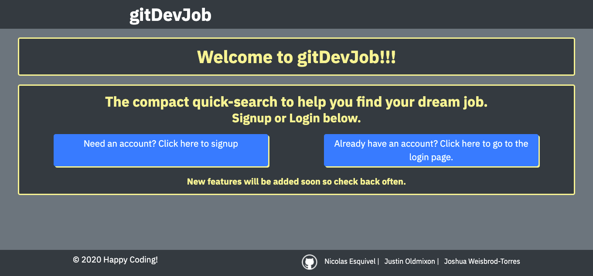
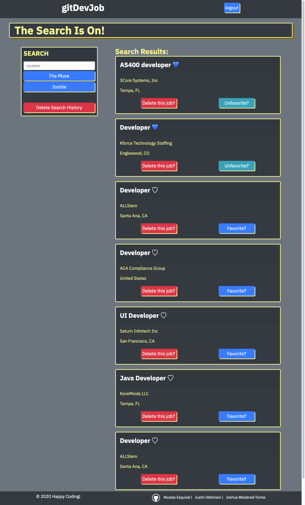
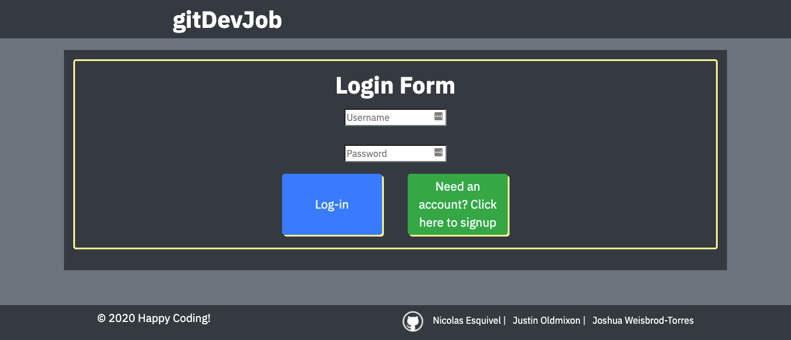
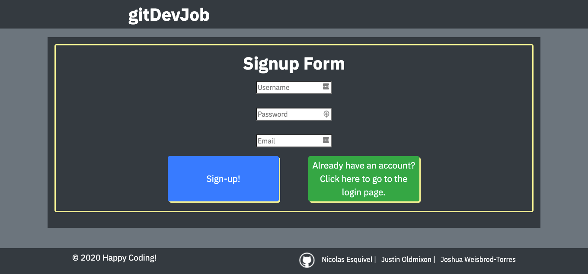

# gitDevJob

An application to keep job hunting from becoming a full-time job for junior developers.

## Description

A conscise application for junior developers to job hunt multiple sites in one application.

## Submission Links

GitHub:

https://github.com/jeoldmixon/TeamProject2

Heroku:

https://secret-journey-15196.herokuapp.com/

## Mock-Up

## User Story

AS A developer
I WANT to be able to search multiple job sites
SO THAT I can browse multiple jobs without having to create multiple logins.
I WANT to be able to save favorite jobs
SO THAT I can apply for them without having to apply immediately.

## Technologies

- JavaScript
- Node.js
- Express
- Express-Sessions
- Handlebars
- Express-Handlebars
- Axios
- Bcrypt
- Connect-Session-Sequelize
- MySQL2
- Sequelize
- Node-fetch
- GIT
- GitHub

## Contributors

[Justin E. Oldmixon](https://github.com/jeoldmixon)
[Joshua Weisbrod-Torres](https://github.com/joshuaweisbrodtorres)
[Nicolas Esteban Esquivel Ruiz](https://github.com/NIKO09ES)
